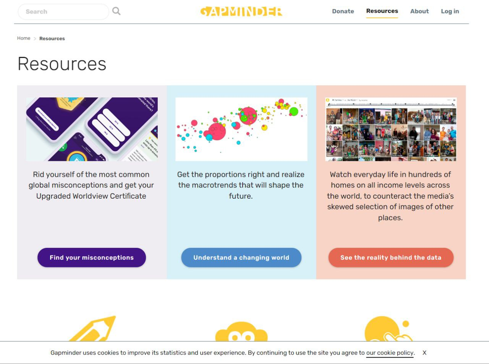
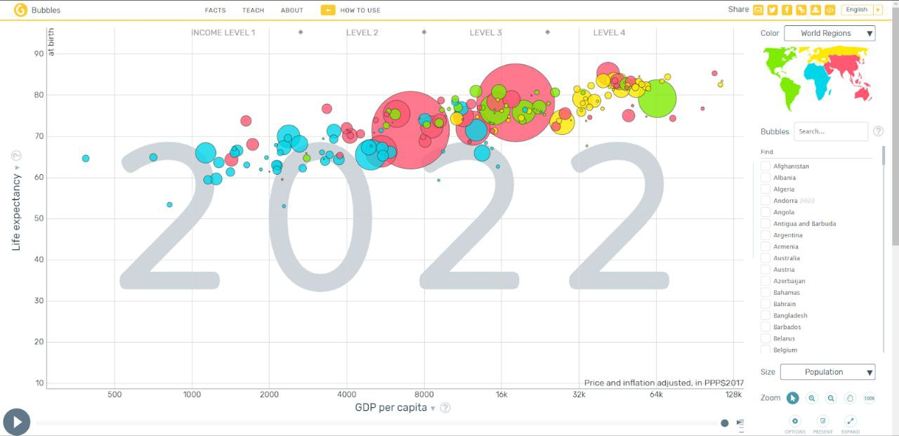
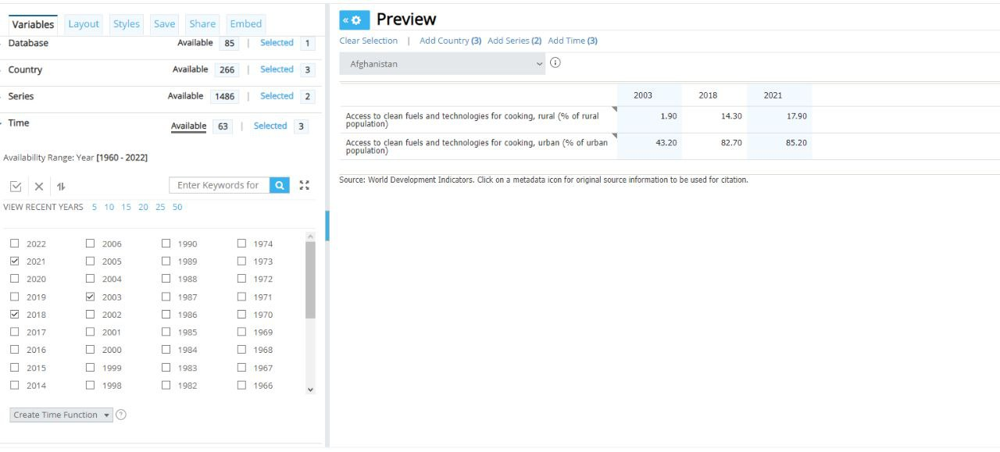
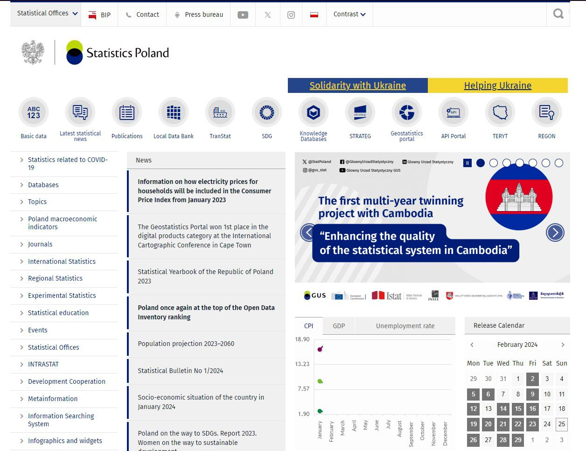
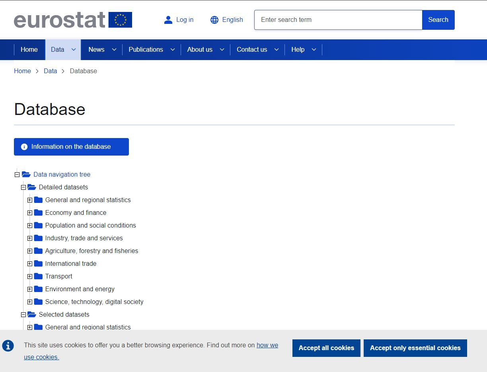
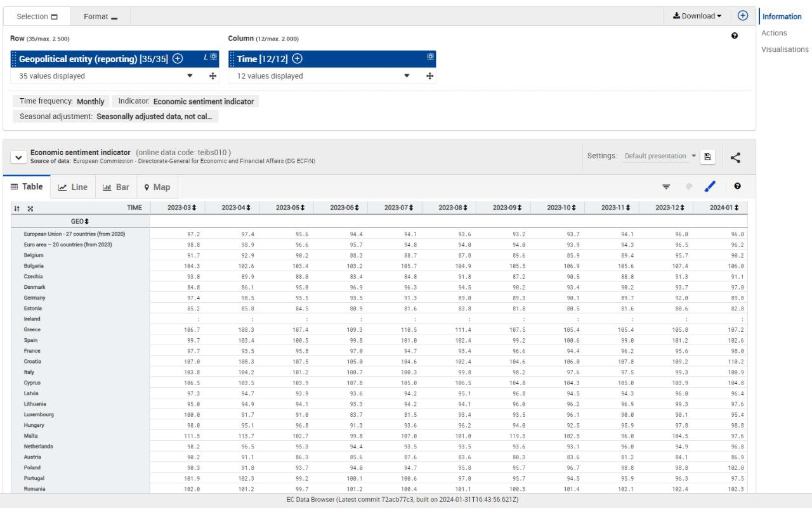
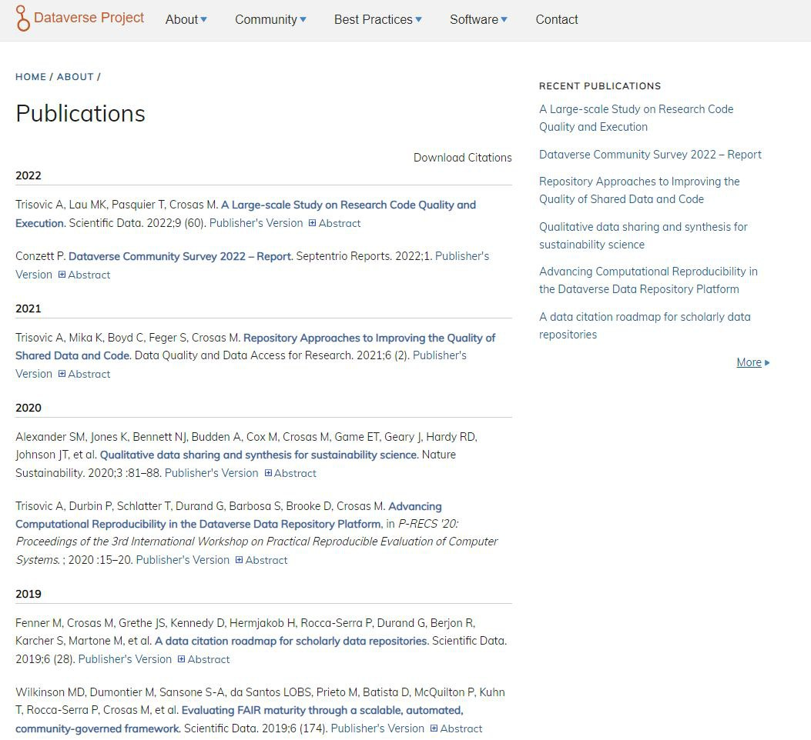

# Аналіз предметної області

## Вступ
*У даному документі представленно такі підрозділи:*  
- Основні терміни та їх скорочення, які були використані при написанні роботи;
- Опис моделей та способів вирішення завдань;
- Опис інуючих аналогів;
- Порівняльна характеристика FURPS;
- Висновки щоди розробки інформаційної системи;
- Список документів, які згадуються в проекті;

## Основні визначення
[API(Application Programming Interface)](https://hostiq.ua/blog/ukr/what-is-api/) — це посередник між програмами, який задає правила «спілкування».    
[XML(EXtensible Markup Language)](https://uk.wikipedia.org/wiki/XML) — це стандарт побудови мов розмітки ієрархічно структурованих даних для обміну між різними застосунками, зокрема, через Інтернет.  
[Відкриті дані](https://uk.wikipedia.org/wiki/%D0%92%D1%96%D0%B4%D0%BA%D1%80%D0%B8%D1%82%D1%96_%D0%B4%D0%B0%D0%BD%D1%96) — це концепція, за якою певні дані мають бути вільними для використання та розповсюдження будь-якою особою з будь-якою метою.  
[База Даних(БД)(Data Base)](https://apeps.kpi.ua/shco-take-basa-danykh) — це організована структура, яка призначена для зберігання, зміни та обробки взаємозалежної інформації, переважно великих обсягів.  
[Модель даних](https://www.miyklas.com.ua/p/informatica/10-klas/sistemi-keruvannia-bazami-danikh-326161/skbd-reliatciini-bazi-danikh-326453/re-ecb32162-0c19-4c15-bc5d-61d53b7add6b) — це опис об’єкта дослідження, виділення окремих параметрів (атрибутів) цього об’єкта, підготовка до добору та внесення конкретних даних (значень атрибутів).  

Найпоширенішими є такі види моделей БД:  
- Ієрархічна — це модель, де використовується представлення бази даних у вигляді деревовидної (ієрархічної) структури, що складається з об'єктів (даних) різних рівнів. За ієрархічною моделлю функціонує файлова система комп’ютера.  
- Реляційна БД (від англ. relation — зв’язок) являє собою сукупність зв’язаних таблиць, що містять дані про об’єкти певного виду.  
- Об’єктно-орієнтована модель даних — це модель БД, в якій дані зберігаються як абстрактні об’єкти, наділені певними властивостями та можливостями (методами) взаємодіяти з іншими об’єктами.  
  
[SQL(Structured Query Language)](https://avada-media.ua/ua/sql/) - це мова програмування, єдина функція якої - відправлення запитів до реляційних баз даних.

## Підходи та способи вирішення завдання

Методи отримання відкритих даних 

[Веб-краулінг](https://uk.wikipedia.org/wiki/%D0%9A%D1%80%D0%B0%D1%83%D0%BB%D1%96%D0%BD%D0%B3) - автоматичний збір даних з веб-сторінок за допомогою спеціального програмного забезпечення.   
- Плюси: можливість збору великих обсягів даних, автоматизація процесу.  
- Мінуси: потрібні технічні навички, можуть бути проблеми з авторськими правами.

[Веб-скрейпінг](https://sparsim.org/uk/perevahy-ta-nedoliky-veb-skripinhu/) - вилучення даних з веб-сторінок вручну або за допомогою простих скриптів.
- Плюси: не потрібні глибокі технічні навички.  
- Мінуси: трудомісткий ручний процес, не можна зібрати великі обсяги даних.  

[Краудфандинг](https://iqdecision.com/ua/kraudfanding-plyusi-ta-minusi/) - збір відкритих даних за підтримки волонтерів або учасників фінансування.  
- Плюси: залучення зацікавлених людей, отримання унікальних даних.  
- Мінуси: потрібні ресурси на координацію, результати можуть бути непередбачуваними.

[API](https://brainlab.com.ua/uk/blog-uk/shho-take-api) - використання готових програмних інтерфейсів для автоматичного отримання даних.  
- Плюси: зручність, швидкість, можливість інтеграції даних.  
- Мінуси: обмеження по кількості запитів, потрібні навички розробки.  

Типи даних та способи їх збереження   

Структуровані дані (таблиці, бази даних):  
 - Локальне зберігання (на жорсткому диску, зовнішніх носіях)  
    - Плюси: повний контроль, немає залежності від інтернету   
    - Мінуси: ризик втрати даних, потрібне резервне копіювання  
 - Хмарні сховища (AWS S3, MongoDB Atlas, Firebase)   
    - Плюси: надійність, масштабованість, швидкий доступ   
    - Мінуси: залежність від провайдера, вартість  

Неструктуровані дані (texto, зображення, аудіо/відео)    
 - Локальне зберігання  
    - Плюси: повний контроль, доступ без інтернету   
    - Мінуси: обмеженість простору  
 - Хмарні сховища (AWS S3, Google Cloud Storage, Dropbox)   
    - Плюси: масштабованість, швидкий доступ   
    - Мінуси: цінова політика за трафік та зберігання  

Аналіз даних 

Excel і табличні процесори (Excel, Google Tables)   
- Плюси: простота, швидкість, візуалізація   
- Мінуси: обмежені можливості аналізу великих обсягів даних  

Мови програмування (Python, R)   
- Плюси: гнучкість, широкий набір бібліотек і методів аналізу   
- Мінуси: потрібні навички програмування  

Спеціалізовані аналітичні платформи (Tableau, Power BI, Qlik)   
- Плюси: багато функцій візуалізації та аналізу, зручний інтерфейс  
- Мінуси: обмеження за обсягами та видами аналізу, вартість  

Хмарні аналітичні сервіси (Google BigQuery)  
- Плюси: масштабованість, можливість аналізу великих даних   
- Мінуси: складність налаштування, вартість  

Машинне навчання (TensorFlow, PyTorch)  
- Плюси: автоматизація аналізу, глибокий аналіз даних   
- Мінуси: потрібні висока кваліфікація, значні обчислювальні ресурси  

Візуалізація 

Візуалізація даних використовується для легкого сприйняття великих об’ємів даних. 
Є декілька типів візуальних даних:  

- Лінійні графіки. Показують тенденції, піки і спади, що особливо корисно при аналізі продажів, акцій або погодних умов. Ідеальні для відображення змін у часі.  
- Стовпчасті діаграми. Гарні для зіставлення даних і рейтингів. Мають вигляд вертикальних або горизонтальних стовпців, чия висота пропорційна значенню змінної.  
- Кругові діаграми. Підходять для візуалізації процентного розподілу або часток цілого.  
- Теплові карти. Представляють дані у вигляді системи колірних кодів, щоб швидко визначити області з найбільшою і найменшою концентрацією або інтенсивністю чого-небудь (аналіз вебтрафіку, дослідження ринку тощо).  
- Scatter plot. Використовуються для вивчення зв’язків між змінними. Вони показують розподіл точок на графіку і допомагають виявити кореляцію або викиди.  
- Географічні діаграми. Дають змогу візуалізувати інформацію в контексті конкретних регіонів чи країн.  
- Інфографіка. Комбінує різні типи візуалізації даних із текстом, зображеннями та іншими елементами дизайну для створення захопливого і простого представлення даних.  

Для візуалізації даних використовують різні інструменти потипу, Google Charts  Polymaps, Microsoft Excel & Power BI, Figma, Tableau тощо.

Моделі та методи контролю доступу 

Контроль та управління правом доступу вирішують завдання щодо захисту від незаконного проникнення на об'єкти та несанкціонованого використання ресурсів. Практичну дієвість зобразили чотири науково розроблених моделі та методи управління доступом, де враховані як специфіки суб'єктів, так і ступінь важливості безпеки об'єктів або ресурсів.

Моделі управління доступом поділяються на такі категорії:
- дискреційне (виборче) управління;  
- обов'язковий (мандатний) метод управління;  
- рольова модель управління;  
- управління доступом на основі правил;  

Модель рольового управління доступом 

Основний принцип рольової моделі передбачає розподіл функцій персоналу з урахуванням виду діяльності організації в цілому або роботи конкретного підрозділу, або при виконанні судових проектів. При використанні рольового методу немає потреби визначати тип доступу для кожного окремого користувача ресурсом. Досить встановити ступінь допуску для ролі, яку виконує користувач ресурсу відповідно до посадових обов'язків або при виконанні окремого завдання. При цьому, допуск строго визначений роллю виконуваної співробітником та не виходить за межі, визначені початковим сценарієм.

Перевага рольового методу полягає в тому, що доступом до ресурсу може користуватися кілька користувачів, які призначені на одну і ту ж роль або навпаки — один співробітник призначається на виконання декількох ролей без перегляду індивідуального рівня доступу. Однак, якщо в інтересах роботи виконавець вимагає розширити сферу допуску, передбачену роллю, то адміністратор переглядає ступінь доступу для кожного конкретного випадку. Метод рольового управління СКУД найбільш підходить для динамічних та мінливих хмарних систем управління.

Контроль та управління доступом на основі правил 

Ця форма управління схожа з рольовим методом, але відрізняється тим, що власниками об'єктів та адміністратором ресурсів встановлюються чіткі правила щодо обмеження доступу до об'єкта в певний час доби або дозволяється тільки з конкретного пристрою. Крім того, дозволи до допуску можуть бути визначені кількістю попередніх спроб входу або місцем знаходження користувача. Також дозволи на доступ можуть бути визначені комбінацією встановлених правилами дій.

Ця модель відмінно підходить для управління доступом в організаціях, які мають велику кількість об'єктів з різним ступенем рівня доступу та різним регламентом роботи. Гнучкість системи безпеки на основі правил дозволяє визначати безліч комбінацій доступу в залежності від мінливого оточення.

## Порівняльна характеристика існуючих засобів вирішення завдання
[Фундація Gapminder](https://uk.wikipedia.org/wiki/Фундація_Gapminder) – незалежна, некомерційна організація, що сприяє сталому глобальному розвитку використання і розуміння статистичних даних та іншої інформації, шляхом використання і розуміння різних глобальних фактів про країни світу, їх проблеми, економічний та екологічний розвиток. Для візуалізації даних, використовується програмне забезпечення [Trendalyzer](https://en.wikipedia.org/wiki/Trendalyzer).  

[DataBank](https://databank.worldbank.org/home.aspx) - це інструмент для аналізу та візуалізації, який містить колекції даних часових рядів на різні теми, де можна створювати власні запити, генерувати таблиці, діаграми та карти, а також легко зберігати, вбудовувати та ділитися ними.

  

[Google Public Data Explorer](https://uk.wikipedia.org/wiki/Google_Public_Data_Explorer) – інструмент, що надає загальнодоступні дані і прогнози від ряду міжнародних організацій і наукових установ, які можуть відображатись у вигляді лінійних графіків, гістограм, тощо. Також він є загальнодоступним для завантаження, обміну та візуалізації наборів даних.

  

[Statistics Poland](https://en.wikipedia.org/wiki/Statistics_Poland) – є головним органом виконавчої влади Польщі, відповідальним за збір та публікацію статистичних даних, пов'язаних з економікою, населенням та суспільством країни, на національному та місцевому рівнях.

[Eurostat](https://commission.europa.eu/about-european-commission/departments-and-executive-agencies/eurostat-european-statistics_en) — це статистичне відомство Європейського Союзу, відповідальне за публікацію загальноєвропейської статистики та індикаторів, які дозволяють проводити порівняння між країнами та регіонами.

 

[Dataverse](https://en.wikipedia.org/wiki/Dataverse) - це веб-додаток з відкритим вихідним кодом для обміну, збереження, цитування, вивчення та аналізу дослідницьких даних.
Репозитарій простору даних містить кілька просторів даних(dataverses). Кожен простір даних(dataverse) містить набір(и) даних(dataset(s)) або інші простори даних(dataverse(s)), і кожен набір даних містить описові метадані та файли даних (включно з документацією та кодом, що супроводжують дані)

  

Таблиця порівняння 

| Загальні вимоги | Конкретні вимоги | Наш проєкт | Grapminder | DataBank | G.P.D.E | Poland Stat. | EuroStat. | Dataverse |
|-------------|-------------|-------------|-------------|-------------|-------------|-------------|-------------|-------------|
| Functionality | Візуалізація даних | ✅ | ✅ | ✅ | ✅ | ✅ | ✅ | ✅ |
| | Додавання/редагування даних | ✅ | ❌ | ✅ | ✅ | ❌ | ❌ | ✅ |
| | Можливість аторізовуватись | ✅ | ✅ | ✅ | ✅ | ❌ | ✅ | ❌ |
| | Можливість пошуку/фільтрування інформації | ✅ | 🟨 | ✅ | 🟨 | ✅ | ✅ | ✅ |
| Usability | Підтримка інших мов | ❌ | 🟨 | ✅ | ✅ | 🟨 | ✅ | ❌ |
| | Зручність Інтерфейсу | ✅ | ✅ | ✅ | 🟨 | ✅ | ✅ | 🟨 |
| | Документація | ✅ | 🟨 | 🟨 | ✅ | ✅ | ✅ | ✅ |
| Reliability | Актуальність даних | ✅ | 🟨 | ✅ | 🟨 | ✅ | ✅ | 🟨 | 
| | Резервне копіювання даних | ✅ | ✅ | ✅ | ✅ | ✅ | ✅ | ✅ |
| | Ліцензійність | ✅ | ✅ | ✅ | ✅ | ✅ | ✅ | ✅ |
| Performance | Стійкість у разі неполадок/збоїв | ✅ | ✅ | ✅ | ✅ | ✅ | ✅ | ✅ |
| | Ефективність обробки запитів | ✅ | 🟨 | ✅ | ✅ | 🟨 | ✅ | 🟨 |
| Supportability | Підтримка | ✅ | ✅ | ✅ | ✅ | 🟨 | ✅ | ✅ |
| | FAQ | ✅ | ✅ | ✅ | ✅ | ❌ | ✅ | ❌ |
| | Зворотній зв’язок | ✅ | ✅ | ✅ | ✅ | ✅ | ✅ | ✅ |

## Висновки
Наша команда провела ретельний аналіз існуючих програмних продуктів та веб-застосунків для управління відкритими даними. Серед них:  

- Dataverse: володіє більшістю інструментів для реалізації повного життєвого циклу даних, але не має засобів візуалізації та працює в режимі обмеженого доступу.  
- Google Public Data Explorer: пропонує потужні інструменти візуалізації, але не має функціоналу для роботи з датасетами та керування версіями.  
- Інші: існують й інші рішення, але вони не володіють комплексом необхідних функцій або мають суттєві обмеження.  

На основі проведеного аналізу, наша команда дійшла висновку, що розробка нової веб-системи управління відкритими даними буде кращим рішенням, адже вона:  

- Має систему для додавання та редагування даних : авторизовані користувачі зможуть давати поради/зауваження адмінам та це зможе покращити наш сервіс.  
- Буде доступною для всіх: система буде доступна для широкого кола користувачів, без обмежень та платних підписок.  
- Відповідатиме потребам користувачів: система буде мати зручний інтерфейс та актуальні дані, а також буде мати ефективну систему оброку запитів.  

Розробка нової веб-системи управління відкритими даними стане значним кроком вперед у цій сфері, надавши користувачам потужний та зручний інструмент для роботи з даними.  

## Посилання
- [GRAPMINDER](https://www.gapminder.org/)  
- [The World Bank DataBank](https://databank.worldbank.org/home.aspx)  
- [Google Public Data Explorer](https://www.google.com/publicdata/directory)  
- [Statistic Poland](https://stat.gov.pl/en/)  
- [Eurostat](https://ec.europa.eu/eurostat/data/database)  
- [Бази даних та основні поняття](https://sites.google.com/view/ddkbmta-info/%D0%BB%D0%B5%D0%BA%D1%86%D1%96%D1%97/%D1%81%D0%B8%D1%81%D1%82%D0%B5%D0%BC%D0%B8-%D0%BA%D0%B5%D1%80%D1%83%D0%B2%D0%B0%D0%BD%D0%BD%D1%8F-%D0%B1%D0%B0%D0%B7%D0%B0%D0%BC%D0%B8-%D0%B4%D0%B0%D0%BD%D0%B8%D1%85-microsoft-access/%D0%BE%D1%81%D0%BD%D0%BE%D0%B2%D0%BD%D1%96-%D0%BF%D0%BE%D0%BD%D1%8F%D1%82%D1%82%D1%8F-%D0%B1%D0%B0%D0%B7-%D0%B4%D0%B0%D0%BD%D0%B8%D1%85)  
- [Візуалізація даних](https://goit.global/ua/articles/vizualizatsiia-danykh-pryntsypy-sposoby-ta-korysni-instrumenty/)
- [Інструменти візуалізації](https://toplead.com.ua/ua/blog/id/38-luchshih-instrumentov-dlja-vizualizacii-dannyh-160/)
- [Моделі та методи контролю доступу](https://worldvision.com.ua/modeli-i-metody-kontrolya-dostupa-chto-vam-podkhodit/)
