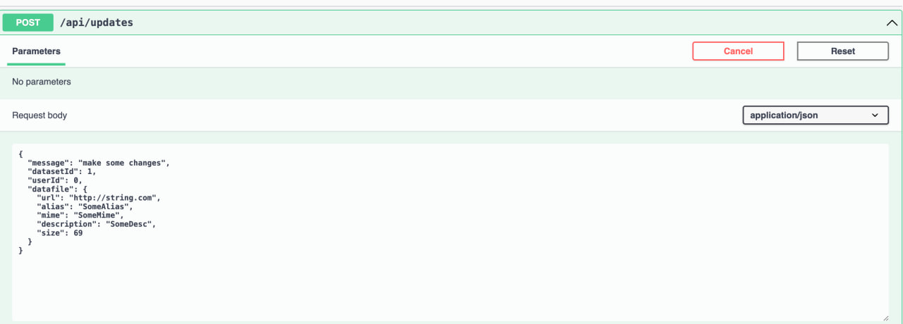
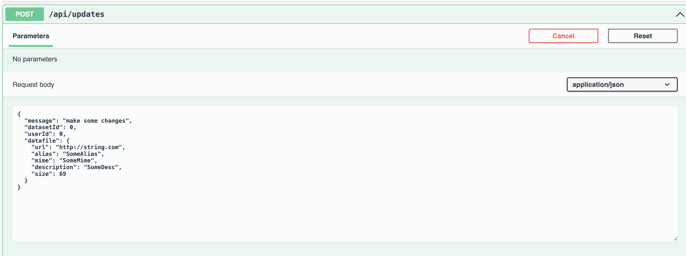
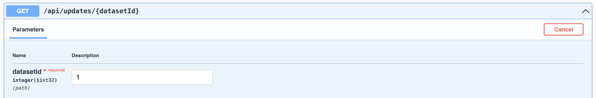
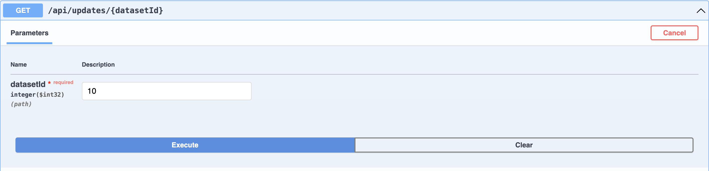

# Тестування працездатності системи

## Тестування збереження змін у файлі дата сету

### Запит


### Відповідь
```json
{
  "hash": "2b3fa19bff8d76b3ec3e6ee9cf69e1895a6db767ebeb512f380c8efad6e4dc09",
  "updatetAt": "2024-05-29T18:55:24.963929Z",
  "message": "make some changes",
  "difference": {
    "Alias": {
      "old": "Alias",
      "new": "SomeAlias"
    },
    "Mime": {
      "old": "Mime",
      "new": "SomeMime"
    },
    "Description": {
      "old": "Desc",
      "new": "SomeDesc"
    },
    "Size": {
      "old": 150,
      "new": 69
    },
    "UploadedAt": {
      "old": "2024-05-28T08:10:42.514923Z",
      "new": "2024-05-29T18:55:24.82847Z"
    },
    "UserId": "no changes",
    "Url": {
      "old": "google.com",
      "new": "http://string.com"
    }
  },
  "userId": 0
}
```
### Запит


### Відповідь
```json
Dataset not found
```

## Вивід всіх змін за ідентифікатором датасету

### Запит


### Відповідь
```json
[
  {
    "hash": "9fa6af6a0fcec419db26ad69789a9795760d3621071d16ed67322624decd6cce",
    "updatetAt": "2024-05-28T08:10:42.637051Z",
    "message": "new update test2",
    "difference": {
      "Alias": "no changes",
      "Mime": "no changes",
      "Description": "no changes",
      "Size": "no changes",
      "UploadedAt": {
        "old": "2024-05-28T08:07:50.675716Z",
        "new": "2024-05-28T08:10:42.514923Z"
      },
      "UserId": "no changes",
      "Url": "no changes"
    },
    "userId": 0
  },
  {
    "hash": "2b3fa19bff8d76b3ec3e6ee9cf69e1895a6db767ebeb512f380c8efad6e4dc09",
    "updatetAt": "2024-05-29T18:55:24.963929Z",
    "message": "make some changes",
    "difference": {
      "Alias": {
        "old": "Alias",
        "new": "SomeAlias"
      },
      "Mime": {
        "old": "Mime",
        "new": "SomeMime"
      },
      "Description": {
        "old": "Desc",
        "new": "SomeDesc"
      },
      "Size": {
        "old": 150,
        "new": 69
      },
      "UploadedAt": {
        "old": "2024-05-28T08:10:42.514923Z",
        "new": "2024-05-29T18:55:24.82847Z"
      },
      "UserId": "no changes",
      "Url": {
        "old": "google.com",
        "new": "http://string.com"
      }
    },
    "userId": 0
  }
]
```
### Запит



### Відповідь
```json
No updates found
```
